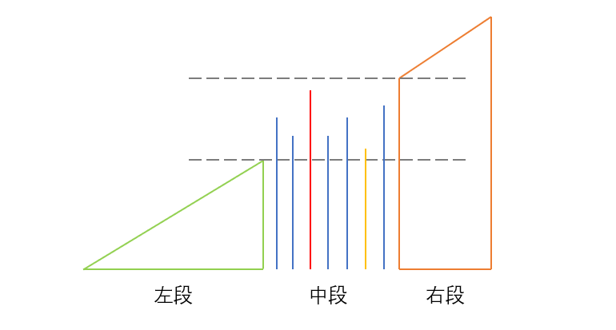

# 最短无序连续子数组

## 分析
我们可以把数组分为3段，左段和右段都是标准的非降排序，中段是需要排序的乱序数组，但是其最小值大于等于左段的最大值，最大值小于等于右段的最小值。



**寻找右边界**：从左到右遍历，维护一个最大值，最后一个比最大值小的元素就是右边界。
**寻找左边界**：从右到左遍历，维护一个最小值，最后一个比最小值小的元素就是左边界。

## 代码实现
```js
function findUnsortedSubarray(nums) {
    if(num
    let left = -1
    let right = -1
    let max = -Infinity
    let min = Infinity
    // 寻找右边界
    for(let i = 0; i < nums.length; i++) {
        if(max > nums[i]) {
            right = i
        }else{
            max = nums[i]
        }
    }
    // 寻找左边界
    for(let i = nums.length - 1; i >= 0; i--) {
        if(nums[i] > min) {
            left = i
        }else{
            min = nums[i]
        }
    }

    return right == -1 ? 0 : (right - left + 1)
}
```

## 代码优化
将**左->右**的遍历与**右->左**的遍历放到一次遍历中处理
```js
function findUnsortedSubarray(nums) {
    let n = nums.length
    if(n === 0) return 0
    let left = -1
    let right = -1
    let max = -Infinity
    let min = Infinity
    for(let i = 0; i < n; i++) {
        // 寻找右边界
        if(max > nums[i]) {
            right = i
        }else{
            max = nums[i]
        }
        // 寻找左边界
        let j = n - i - 1
        if(nums[j] > min) {
            j = left
        }else{
            min = nums[j]
        }
    }
    return left === -1 ? 0 : (right - left + 1)
} 
```